# RoboTwin 项目代码设计文档

> 本文档系统性地分析 RoboTwin 2.0 项目的代码架构设计，阐述其核心优势、设计原理与最佳使用方式。

---

## 目录

1. [项目概述与核心优势](#1-项目概述与核心优势)
2. [整体架构设计](#2-整体架构设计)
3. [核心类设计](#3-核心类设计)
4. [任务系统设计](#4-任务系统设计)
5. [机器人控制与运动规划](#5-机器人控制与运动规划)
6. [感知系统设计](#6-感知系统设计)
7. [策略框架设计](#7-策略框架设计)
8. [数据采集流水线](#8-数据采集流水线)
9. [策略评估流水线](#9-策略评估流水线)
10. [配置系统设计](#10-配置系统设计)
11. [域随机化设计](#11-域随机化设计)
12. [最佳实践指南](#12-最佳实践指南)

---

## 1. 项目概述与核心优势

### 1.1 项目定位

RoboTwin 2.0 是一个**可扩展的双臂机器人操作仿真平台与基准**（CVPR 2025 Highlight），基于 SAPIEN 3.0.0b1 物理引擎构建。它提供了从**仿真环境搭建**、**专家数据采集**、**策略训练**到**策略评估**的完整闭环工具链。

核心数据：
- **50+ 双臂操作任务**，覆盖抓取、放置、搬运、工具使用等场景
- **5 种机器人形态**（Aloha-AgileX、Piper、Franka-Panda、ARX-X5、UR5-WSG）
- **11+ 策略基线**（DP、ACT、DP3、RDT、pi0、pi05、OpenVLA-oft、TinyVLA、DexVLA、LLaVA-VLA、GO1）
- **100,000+ 预采集专家轨迹**

### 1.2 核心优势

| 优势 | 说明 | 论文数据 |
|------|------|----------|
| **闭环代码生成** | 利用 VLM 自动生成任务代码，视觉反馈修正错误 | 成功率 47.4% → 71.3% |
| **五维域随机化** | 场景杂物、背景纹理、光照、桌面高度、语言指令 | 未见任务提升 31.9% |
| **跨形态支持** | 自适应抓取姿态生成，适配不同自由度平台 | 低自由度平台提升 22.7% |
| **Sim-to-Real** | 合成数据增强真实世界策略性能 | 真实场景提升 24.4% |
| **标准化基准** | 统一接口评估不同策略，公开排行榜 | 5+ 策略横向对比 |
| **大规模数据集** | 开源 100K+ 专家轨迹，支持多模态观测 | HuggingFace 公开 |

### 1.3 系统总览

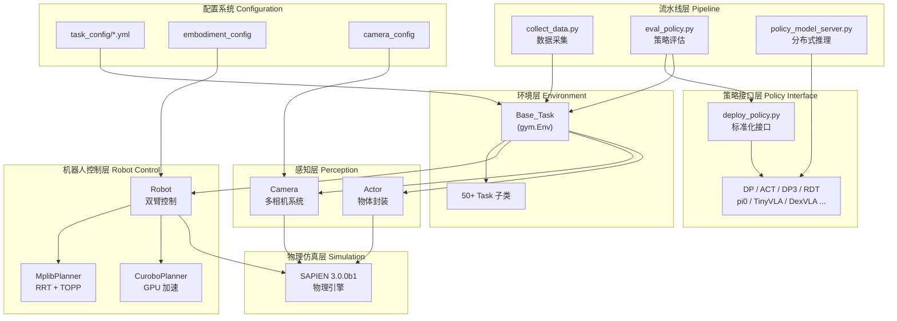

---

## 2. 整体架构设计

### 2.1 分层架构

RoboTwin 采用**六层分层架构**，每层职责清晰、接口明确：

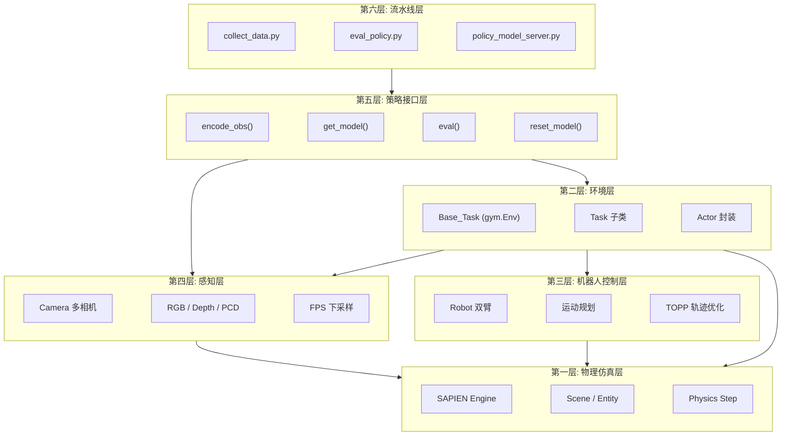

### 2.2 关键设计决策

**为什么继承 `gym.Env`？**

RoboTwin 的 `Base_Task` 继承 Gymnasium 的 `gym.Env`，这是一个经过深思熟虑的选择：
- 与强化学习生态（Stable Baselines、CleanRL 等）无缝集成
- 标准化的 `step()` / `reset()` / `get_obs()` 接口，降低策略适配成本
- 社区共识：研究者熟悉这套 API，新策略可快速接入

**为什么使用 Template Method 模式？**

50+ 任务共享 90% 的初始化和执行逻辑（场景创建、机器人加载、相机设置、物理步进），仅在物体加载 (`load_actors`)、执行逻辑 (`play_once`)、成功判断 (`check_success`) 三处不同。Template Method 将不变的骨架固化在 `Base_Task` 中，子类只需关注任务特定逻辑。

**为什么使用 YAML 配置驱动？**

实验需要大量调参（机器人形态、相机参数、域随机化强度等），硬编码到 Python 中会导致代码膨胀。YAML 配置实现了**代码与参数分离**，同一份代码通过不同配置文件即可生成不同条件的数据。

---

## 3. 核心类设计

### 3.1 类图总览

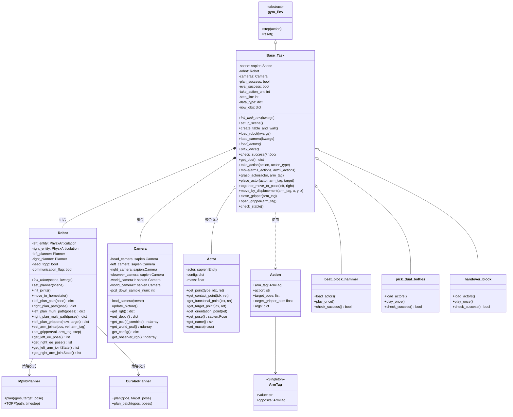

### 3.2 各类职责说明

| 类 | 文件 | 职责 |
|----|------|------|
| `Base_Task` | `envs/_base_task.py` | 任务生命周期管理：场景初始化、物体加载、动作执行、观测采集、数据保存 |
| `Robot` | `envs/robot/robot.py` | 双臂机器人控制：运动规划、关节驱动、夹爪控制、末端执行器状态查询 |
| `Camera` | `envs/camera/camera.py` | 多相机管理：RGB/深度/点云采集、FPS 下采样、相机内外参维护 |
| `Actor` | `envs/utils/actor_utils.py` | 物体操作封装：抓取点、功能点、目标点的世界坐标变换 |
| `Action` | `envs/utils/action.py` | 动作表示：目标位姿 (`move`)、夹爪状态 (`open`/`close`/`gripper`) |
| `ArmTag` | `envs/utils/action.py` | 手臂标识：单例模式，`"left"` / `"right"` 及其反向引用 |

### 3.3 关键数据结构

**观测 (Observation) 数据结构：**

```python
observation = {
    "observation": {
        "head_camera": {
            "intrinsic_cv": ndarray[3,3],   # 相机内参
            "extrinsic_cv": ndarray[4,4],   # 相机外参
            "cam2world_gl": ndarray[4,4],   # 相机到世界变换
            "rgb": ndarray[H,W,3],          # uint8 RGB 图像
            "depth": ndarray[H,W],          # float64 深度 (毫米)
        },
        "left_camera": { ... },
        "right_camera": { ... },
    },
    "joint_action": {
        "left_arm": ndarray[7],             # 左臂关节角度
        "left_gripper": float,              # 归一化 [0,1]
        "right_arm": ndarray[7],            # 右臂关节角度
        "right_gripper": float,             # 归一化 [0,1]
        "vector": ndarray[16],              # 拼接向量
    },
    "endpose": {
        "left_endpose": [x,y,z,qx,qy,qz,qw],
        "left_gripper": float,
        "right_endpose": [x,y,z,qx,qy,qz,qw],
        "right_gripper": float,
    },
    "pointcloud": ndarray[N,6],             # xyz + rgb
}
```

**动作 (Action) 类型：**

| action_type | 格式 | 说明 |
|-------------|------|------|
| `qpos` | `[left_arm(7) + left_gripper(1) + right_arm(7) + right_gripper(1)]` | 关节角度控制 |
| `ee` | `[left_ee(7) + left_gripper(1) + right_ee(7) + right_gripper(1)]` | 末端执行器位姿控制 |
| `delta_ee` | `[left_delta(7) + left_gripper(1) + right_delta(7) + right_gripper(1)]` | 增量末端执行器控制 |

---

## 4. 任务系统设计

### 4.1 Template Method 模式

`Base_Task` 定义了任务的完整生命周期骨架，子类通过重写三个抽象方法来实现具体任务逻辑：

```python
# 子类必须重写的三个方法
class MyTask(Base_Task):
    def load_actors(self):
        """加载任务所需的物体到场景中"""
        self.obj = create_actor(self.scene, ...)
        
    def play_once(self):
        """定义任务的执行逻辑（动作序列）"""
        self.move(
            self.grasp_actor(self.obj, arm_tag="left"),
        )
        
    def check_success(self) -> bool:
        """判断任务是否成功完成"""
        return np.linalg.norm(obj_pos - target_pos) < 0.05
```

### 4.2 任务初始化序列图

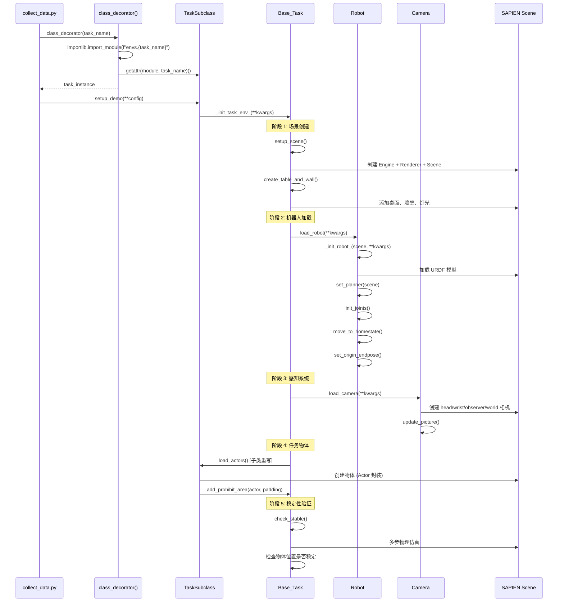

### 4.3 任务执行序列图

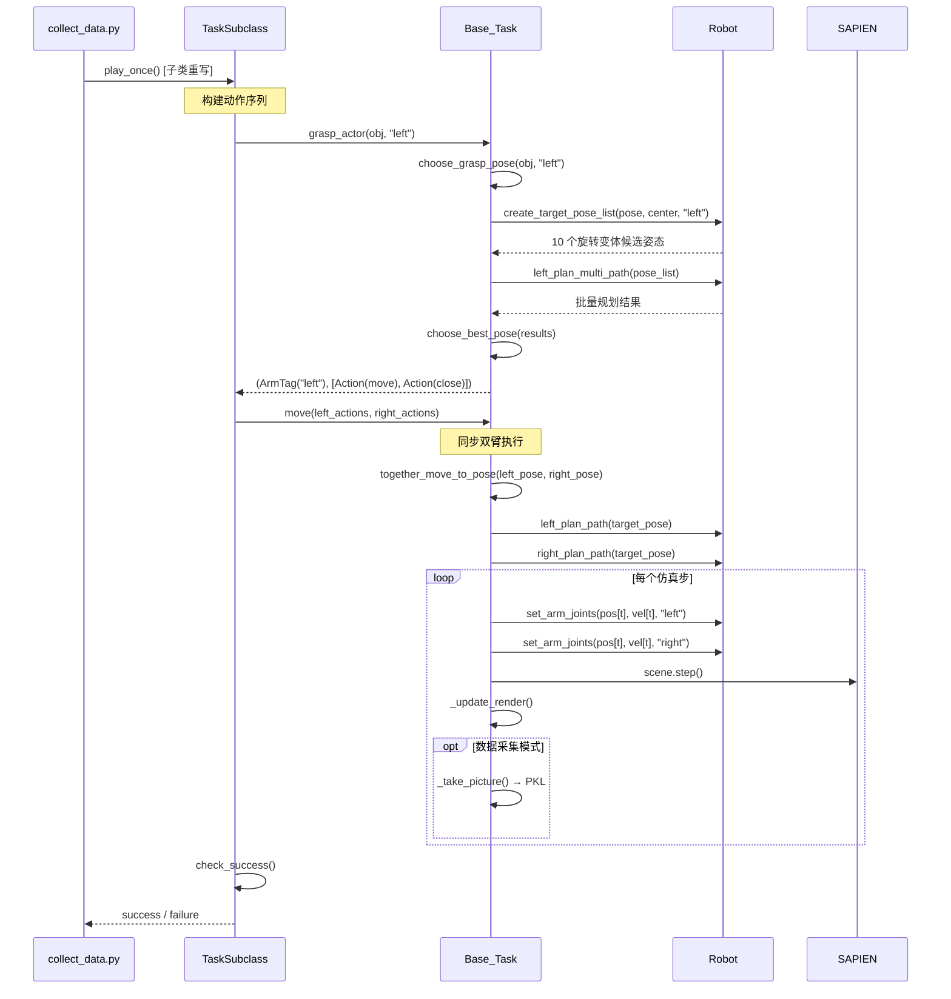

### 4.4 Factory 模式：动态任务加载

任务通过 `importlib` 动态加载，实现了**任务注册零成本**——只需在 `envs/` 目录下创建同名 Python 文件，文件内定义同名类即可：

```python
# script/collect_data.py 中的工厂方法
def class_decorator(task_name):
    envs_module = importlib.import_module(f"envs.{task_name}")
    env_class = getattr(envs_module, task_name)
    env_instance = env_class()
    return env_instance
```

**约定**：`envs/beat_block_hammer.py` 文件内必须定义 `class beat_block_hammer(Base_Task)` 类。文件名与类名严格一致。

### 4.5 示例：pick_dual_bottles 任务流程

```python
class pick_dual_bottles(Base_Task):
    def load_actors(self):
        # 创建两个瓶子和目标位置
        self.bottle1 = create_actor(...)  # 左侧
        self.bottle2 = create_actor(...)  # 右侧
        self.target_left = [x1, y1, z1]
        self.target_right = [x2, y2, z2]

    def play_once(self):
        # 1. 双臂同时抓取
        self.move(
            self.grasp_actor(self.bottle1, "left"),
            self.grasp_actor(self.bottle2, "right")
        )
        # 2. 双臂同时抬起
        self.move(
            self.move_by_displacement("left", z=0.1),
            self.move_by_displacement("right", z=0.1)
        )
        # 3. 双臂同时放置
        self.move(
            self.place_actor(self.bottle1, "left", self.target_left),
            self.place_actor(self.bottle2, "right", self.target_right)
        )

    def check_success(self):
        pos1 = self.bottle1.get_pose().p
        pos2 = self.bottle2.get_pose().p
        return (np.linalg.norm(pos1[:2] - self.target_left[:2]) < 0.1 and
                np.linalg.norm(pos2[:2] - self.target_right[:2]) < 0.1)
```

---

## 5. 机器人控制与运动规划

### 5.1 双臂架构设计

`Robot` 类采用**左右对称镜像 API** 设计，每条手臂拥有独立的规划器、关节控制和状态查询：

```
Robot
├── 左臂 (left)
│   ├── left_entity → URDF 模型
│   ├── left_planner → 运动规划器
│   ├── left_arm_joints → 7 自由度关节
│   ├── left_gripper → 夹爪
│   └── left_ee → 末端执行器
└── 右臂 (right)
    ├── right_entity → URDF 模型
    ├── right_planner → 运动规划器
    ├── right_arm_joints → 7 自由度关节
    ├── right_gripper → 夹爪
    └── right_ee → 末端执行器
```

**两种构型模式**：
- **单一构型** (`dual_arm_embodied=True`)：如 Aloha-AgileX，左右臂在同一个 URDF 模型中
- **独立构型** (`dual_arm_embodied=False`)：如 Franka + UR5，左右臂是不同的机器人模型，通过 `embodiment_dis` 设置间距

### 5.2 运动规划策略

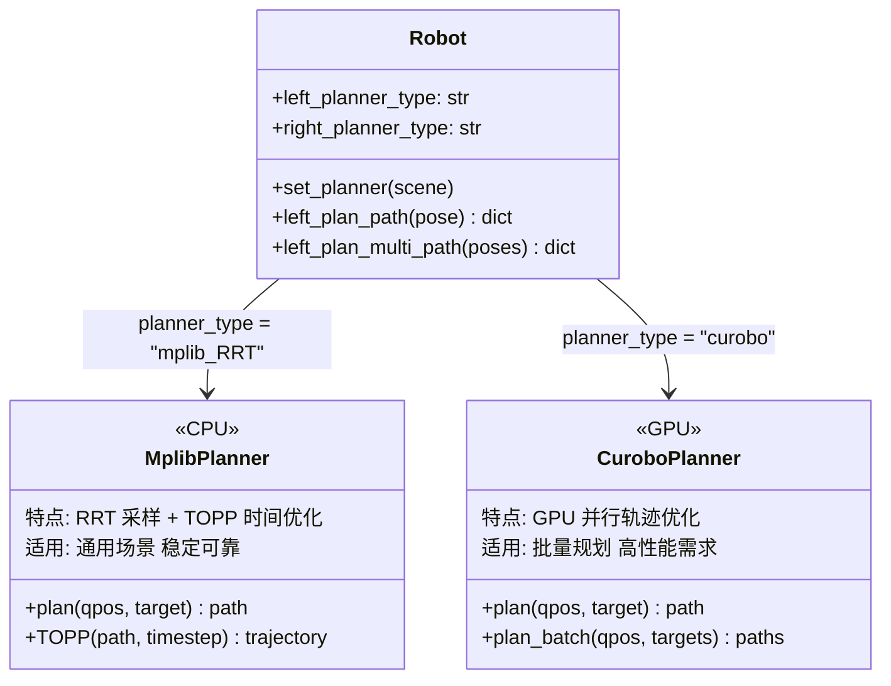

### 5.3 运动规划序列图

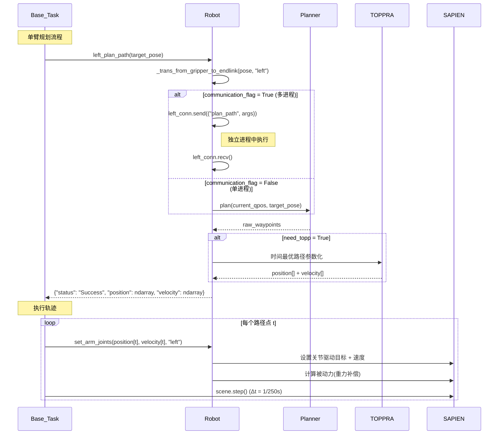

### 5.4 批量抓取姿态选择

抓取操作中，`Robot` 会为一个基准抓取姿态生成 **10 个旋转变体**（`ROTATE_NUM=10`），然后通过批量规划找到最优可达姿态：

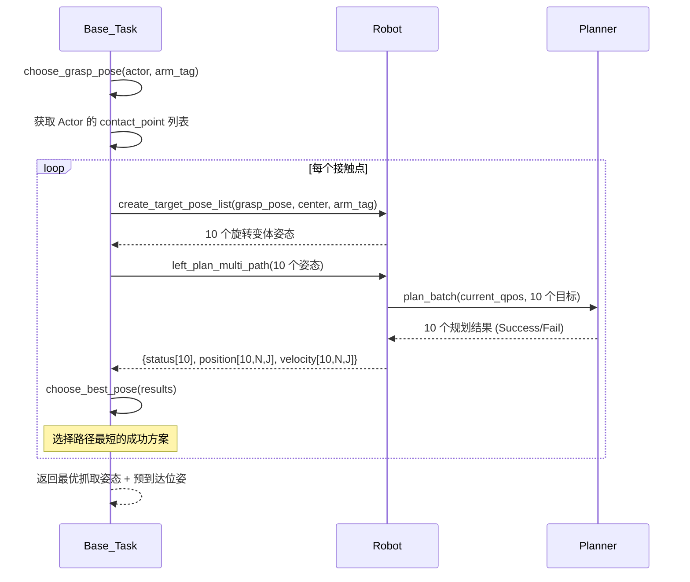

### 5.5 同步双臂执行

双臂同时运动时，采用**归一化进度同步**策略，确保两臂协调运动：

```python
# 核心同步逻辑 (简化)
now_left_id, now_right_id = 0, 0
while now_left_id < left_n_step or now_right_id < right_n_step:
    left_progress = now_left_id / left_n_step
    right_progress = now_right_id / right_n_step
    
    if now_left_id < left_n_step and left_progress <= right_progress:
        robot.set_arm_joints(left_pos[now_left_id], left_vel[now_left_id], "left")
        now_left_id += 1
    
    if now_right_id < right_n_step and right_progress <= left_progress:
        robot.set_arm_joints(right_pos[now_right_id], right_vel[now_right_id], "right")
        now_right_id += 1
    
    scene.step()
```

---

## 6. 感知系统设计

### 6.1 多相机配置

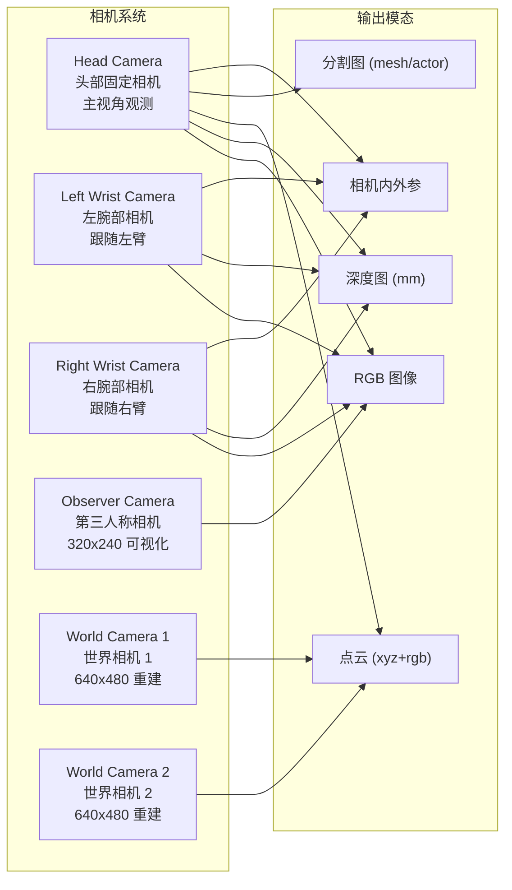

### 6.2 点云处理流程

点云生成采用 **Farthest Point Sampling (FPS)** 进行下采样，确保空间均匀覆盖：

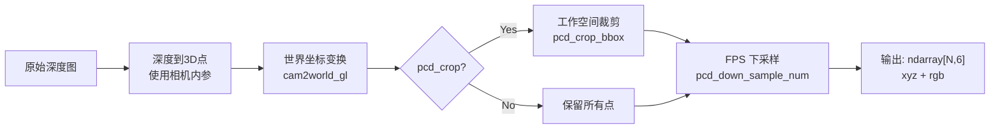

### 6.3 相机类型规格

| 类型 | 分辨率 | FOV | 用途 |
|------|--------|-----|------|
| D435 | 320x240 | 37° | 默认相机（head/wrist）|
| Large_D435 | 640x480 | 37° | 高分辨率版本 |
| L515 | 320x180 | 45° | 宽视角相机 |
| Large_L515 | 640x360 | 45° | 高分辨率宽视角 |

---

## 7. 策略框架设计

### 7.1 标准化接口

所有策略必须在 `deploy_policy.py` 中实现四个函数：

```python
def encode_obs(observation: dict) -> dict:
    """将环境观测转换为模型输入格式"""
    
def get_model(usr_args: dict) -> Model:
    """加载模型检查点，返回初始化好的模型"""
    
def eval(TASK_ENV, model, observation: dict):
    """单步评估：观测 → 推理 → 执行"""
    
def reset_model(model):
    """重置模型状态（观测窗口、时间聚合等）"""
```

### 7.2 策略接口类图

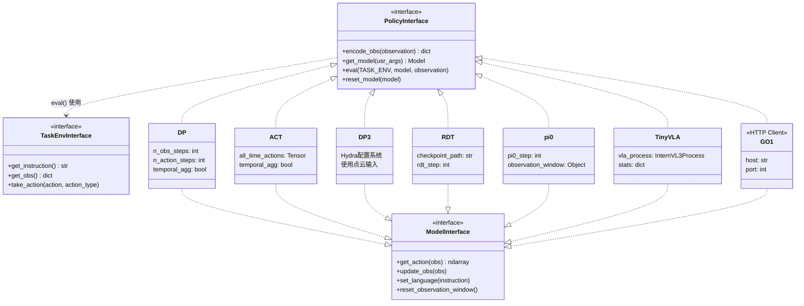

### 7.3 策略评估工作流

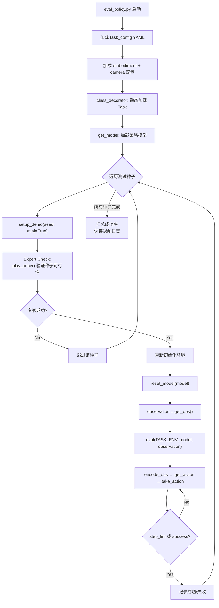

### 7.4 各策略特点对比

| 策略 | 输入模态 | 语言条件 | 时间聚合 | 特殊依赖 |
|------|----------|----------|----------|----------|
| DP | RGB + qpos | 无 | 是 | diffusion_policy |
| ACT | RGB + qpos | 无 | 可选 | DETR |
| DP3 | 点云 + qpos | 无 | 是 | Hydra, 3D-Diffusion-Policy |
| RDT | RGB + qpos | 是 | 否 | Decision Transformer |
| pi0 | RGB + qpos | 是 | 否 | OpenPI |
| TinyVLA | RGB + qpos | 是 | 否 | InternVL3 |
| GO1 | RGB + qpos | 是 | 否 | HTTP 远程推理 |

---

## 8. 数据采集流水线

### 8.1 端到端工作流

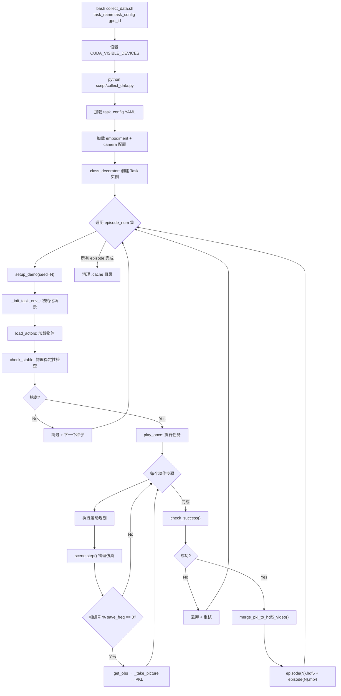

### 8.2 数据存储结构

```
data/{task_name}/{task_config}/
├── .cache/                          # 临时缓存（采集完成后删除）
│   └── episode{N}/
│       ├── 0.pkl                    # 帧 0 的完整观测字典
│       ├── 1.pkl                    # 帧 1
│       └── ...
├── data/
│   ├── episode0.hdf5                # 合并后的 HDF5 数据
│   ├── episode1.hdf5
│   └── ...
├── video/
│   ├── episode0.mp4                 # 第三人称视角视频
│   └── ...
└── _traj_data/
    ├── episode0.pkl                 # 轨迹规划数据
    └── ...
```

**HDF5 内部结构**：

```
episode{N}.hdf5
├── observation/
│   ├── head_camera/
│   │   ├── rgb          [T, H, W, 3] uint8
│   │   ├── depth        [T, H, W] float64
│   │   ├── intrinsic_cv [T, 3, 3]
│   │   └── extrinsic_cv [T, 4, 4]
│   ├── left_camera/ ...
│   └── right_camera/ ...
├── joint_action/
│   ├── left_arm         [T, 7]
│   ├── left_gripper     [T]
│   ├── right_arm        [T, 7]
│   └── right_gripper    [T]
├── endpose/
│   ├── left_endpose     [T, 7]
│   └── right_endpose    [T, 7]
└── pointcloud/          [T, N, 6]
```

---

## 9. 策略评估流水线

### 9.1 本地评估模式

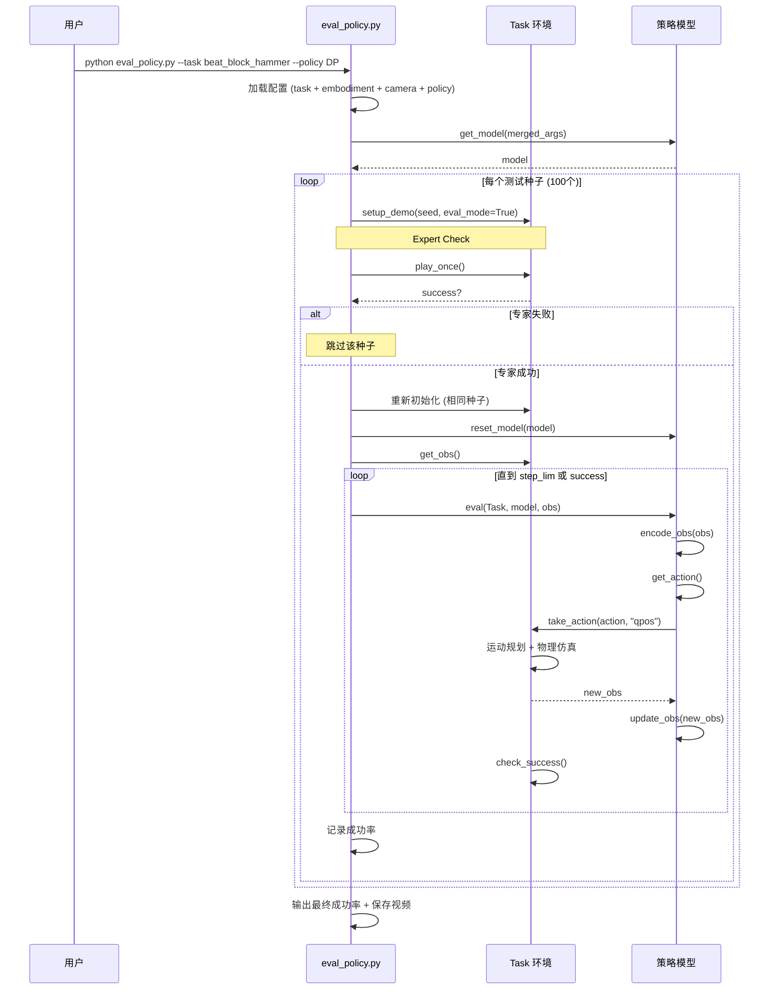

### 9.2 分布式评估架构

当策略模型过大无法与仿真环境共用 GPU 时，采用 **Server/Client 分离**架构：

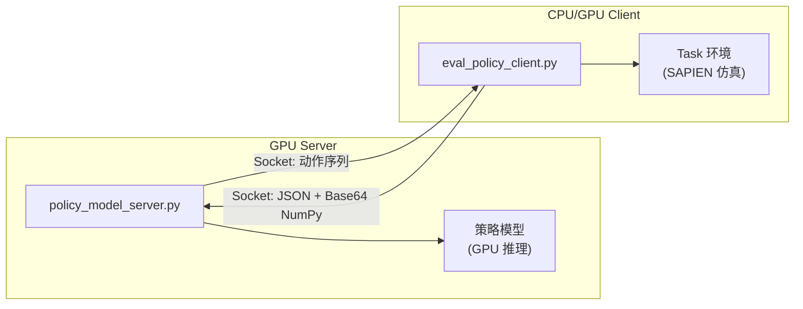

**通信协议**：
```
请求: [4字节长度][JSON 负载]
  JSON: {"cmd": "get_action", "obs": {numpy_array_base64}}

响应: [4字节长度][JSON 负载]
  JSON: {"res": {numpy_array_base64}}
```

NumPy 数组通过 `NumpyEncoder` 序列化为 Base64，保证高效传输。

---

## 10. 配置系统设计

### 10.1 配置层级

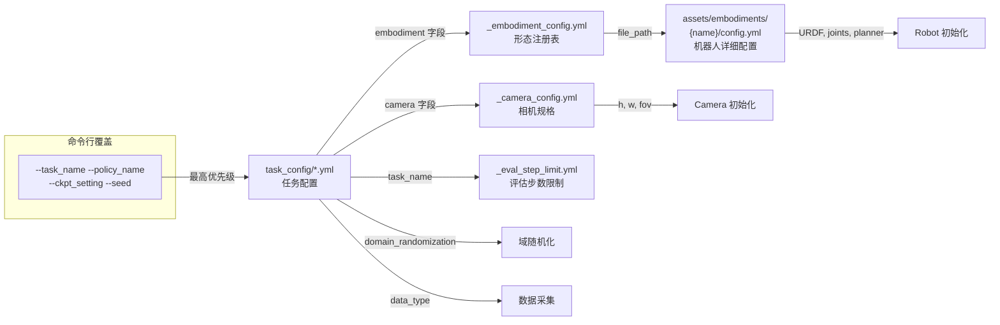

### 10.2 核心配置文件

**任务配置 (`demo_randomized.yml` 示例)**：

```yaml
render_freq: 0                # 渲染频率 (0=无头模式)
episode_num: 50               # 采集集数
save_freq: 15                 # 保存频率 (每N帧)
embodiment: [aloha-agilex]    # 机器人形态

domain_randomization:
  random_background: true     # 随机背景纹理
  cluttered_table: true       # 桌面杂物
  clean_background_rate: 0.02 # 2% 使用干净背景
  random_light: true          # 随机光照
  crazy_random_light_rate: 0.02
  random_table_height: 0.03   # 3cm 桌面高度变化
  random_head_camera_dis: 0.05 # 5cm 相机位置抖动

camera:
  head_camera_type: D435
  wrist_camera_type: D435
  collect_head_camera: true
  collect_wrist_camera: true

data_type:
  rgb: true
  depth: false
  pointcloud: false
  endpose: true
  qpos: true
```

**形态配置 (`_embodiment_config.yml`)**：

```yaml
aloha-agilex:
  file_path: "./assets/embodiments/aloha-agilex/"
piper:
  file_path: "./assets/embodiments/piper"
franka-panda:
  file_path: "./assets/embodiments/franka-panda/"
ARX-X5:
  file_path: "./assets/embodiments/ARX-X5"
ur5-wsg:
  file_path: "./assets/embodiments/ur5-wsg"
```

### 10.3 异构双臂配置

支持**左右臂使用不同机器人**：

```yaml
# 单一形态 (双臂同型)
embodiment: [aloha-agilex]

# 异构形态 (左右不同 + 间距)
embodiment: [franka-panda, piper, 0.8]
#            左臂形态      右臂形态  间距(米)
```

配置解析逻辑：
```python
if len(embodiment_type) == 1:
    # 双臂同型: dual_arm_embodied = True
    left_robot_file = right_robot_file = embodiment_path
elif len(embodiment_type) == 3:
    # 异构双臂: dual_arm_embodied = False
    left_robot_file = embodiment_type[0]
    right_robot_file = embodiment_type[1]
    embodiment_dis = embodiment_type[2]
```

---

## 11. 域随机化设计

### 11.1 五维随机化体系

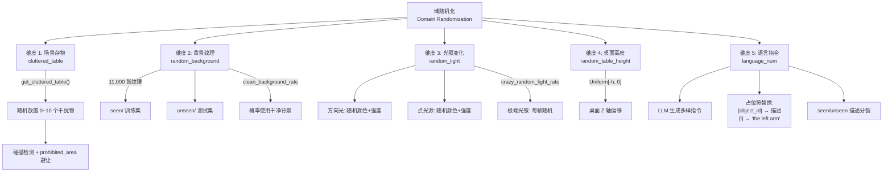

### 11.2 为什么需要五维随机化？

论文实验表明，策略在环境变化时性能下降严重：
- RDT 模型性能下降 **20.8%**
- Pi0 模型性能下降 **30.1%**

五维随机化的协同作用：

| 维度 | 解决的问题 | 对应的真实世界变化 |
|------|-----------|------------------|
| 场景杂物 | 目标检测鲁棒性 | 桌面上有其他无关物品 |
| 背景纹理 | 视觉特征泛化 | 不同房间、桌面材质 |
| 光照变化 | 光照不变性 | 不同时间、灯光条件 |
| 桌面高度 | 空间感知鲁棒性 | 不同高度的工作台 |
| 语言指令 | 语义理解泛化 | 不同表述方式 |

### 11.3 训练/测试分裂设计

域随机化中的 **seen/unseen 分裂** 是评估泛化能力的关键设计：

- **背景纹理**：`assets/background_texture/seen/` vs `unseen/`
- **语言描述**：`objects_description/{obj}/` 中每个物体都有 `"seen"` 和 `"unseen"` 描述列表
- **评估配置**：`instruction_type: "seen"` 或 `"unseen"` 控制使用哪组描述

---

## 12. 最佳实践指南

### 12.1 新建任务

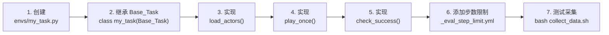

**关键要点**：
- 文件名与类名必须一致（如 `my_task.py` → `class my_task`）
- 使用 `Actor` 封装物体，利用 `get_contact_point()` 获取抓取候选点
- 使用高层 API（`grasp_actor`、`place_actor`、`move_by_displacement`）构建动作序列
- 调用 `self.add_prohibit_area(actor, padding)` 避免杂物与任务物体重叠

### 12.2 新增策略

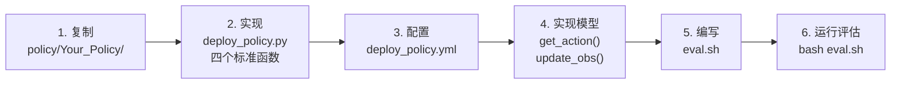

**标准模板**：
```python
# policy/Your_Policy/deploy_policy.py

def encode_obs(observation):
    """提取 RGB 图像和关节状态"""
    head_rgb = observation["observation"]["head_camera"]["rgb"]
    qpos = observation["joint_action"]["vector"]
    return {"image": head_rgb, "state": qpos}

def get_model(usr_args):
    """加载检查点"""
    ckpt_path = f"checkpoints/{usr_args['ckpt_setting']}/model.pt"
    model = YourModel.load(ckpt_path)
    return model

def eval(TASK_ENV, model, observation):
    """推理循环"""
    obs = encode_obs(observation)
    instruction = TASK_ENV.get_instruction()
    model.set_language(instruction)
    
    actions = model.get_action(obs)
    for action in actions:
        TASK_ENV.take_action(action, action_type='qpos')
        observation = TASK_ENV.get_obs()
        obs = encode_obs(observation)
        model.update_obs(obs)

def reset_model(model):
    """重置模型的观测窗口"""
    model.reset_observation_window()
```

### 12.3 新增机器人形态

1. 准备 URDF/SRDF 文件和 `config.yml`，放入 `assets/embodiments/{name}/`
2. 在 `_embodiment_config.yml` 中注册路径
3. `config.yml` 中指定关节名称、夹爪参数、规划器类型、相机位置

### 12.4 域随机化调优

| 场景 | 推荐配置 |
|------|----------|
| **调试/开发** | 使用 `demo_clean.yml`，关闭所有随机化 |
| **训练数据采集** | 使用 `demo_randomized.yml`，开启全部随机化 |
| **控制实验** | 自定义 YAML，逐维度开启以分析各维度贡献 |
| **泛化测试** | 使用 `unseen` 纹理和描述，评估域外性能 |

### 12.5 性能优化建议

- **无头模式**：`render_freq: 0` 关闭可视化，大幅提升采集速度
- **点云下采样**：`pcd_down_sample_num: 1024` 平衡精度与计算量
- **GPU 规划器**：大批量规划时使用 CuroboPlanner 加速
- **分布式推理**：大模型评估使用 server/client 分离，避免 GPU 内存竞争
- **缓存清理**：`clear_cache_freq` 控制 PKL 缓存清理频率，防止磁盘溢出

---

## 附录 A：AI 代码生成系统

`code_gen/` 模块实现了基于 LLM 的**闭环任务代码生成**：

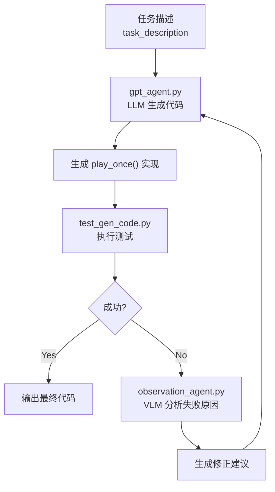

该闭环机制将代码生成成功率从 47.4% 提升至 71.3%，是 RoboTwin 2.0 的核心创新之一。

---

## 附录 B：设计模式总结

| 设计模式 | 应用位置 | 作用 |
|----------|---------|------|
| **Template Method** | `Base_Task` → 50+ Task 子类 | 固化任务生命周期骨架，子类只需实现 3 个方法 |
| **Strategy** | `Robot` → MplibPlanner / CuroboPlanner | 运动规划器可切换，适配不同性能需求 |
| **Factory** | `class_decorator()` + `importlib` | 动态加载任务和策略，零注册成本 |
| **Adapter** | `Actor` 封装 `sapien.Entity` | 为物理引擎对象提供操作语义接口 |
| **Singleton** | `ArmTag("left")` / `ArmTag("right")` | 确保手臂标识唯一性，支持安全比较 |
| **Observer** | `scene.step()` + `_update_render()` | 物理步进与渲染回调解耦 |

---

## 附录 C：依赖关系图

```mermaid
graph TD
    BT["Base_Task"] --> Robot
    BT --> Camera
    BT --> Actor
    BT --> Action
    BT --> SAPIEN["SAPIEN 3.0.0b1"]

    Robot --> MplibPlanner
    Robot --> CuroboPlanner
    Robot --> SAPIEN
    Robot --> transforms3d

    MplibPlanner --> mplib
    MplibPlanner --> toppra

    CuroboPlanner --> curobo["nvidia-curobo"]
    CuroboPlanner --> torch["PyTorch + CUDA"]

    Camera --> SAPIEN
    Camera --> pytorch3d["PyTorch3D (FPS)"]
    Camera --> torch

    Actor --> SAPIEN

    subgraph "数据处理"
        h5py
        imageio
        moviepy
    end

    subgraph "策略框架"
        DP_dep["diffusion_policy"]
        ACT_dep["DETR"]
        DP3_dep["Hydra + OmegaConf"]
        VLA_dep["InternVL3 / OpenVLA"]
    end
```
