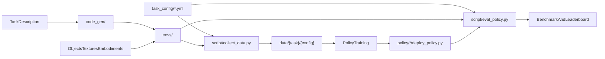
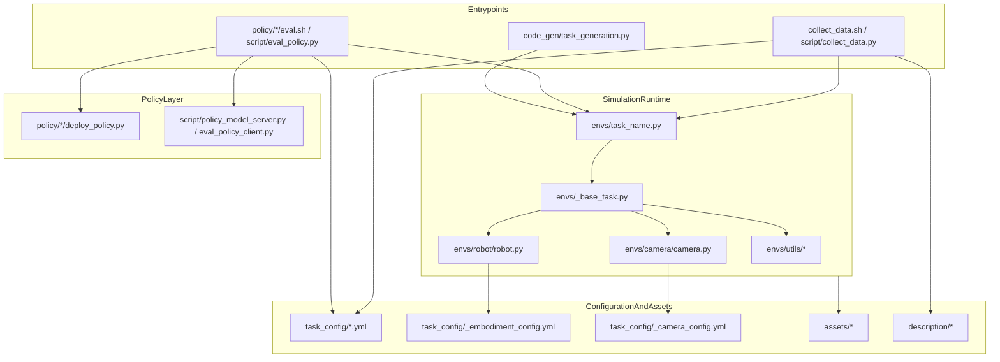
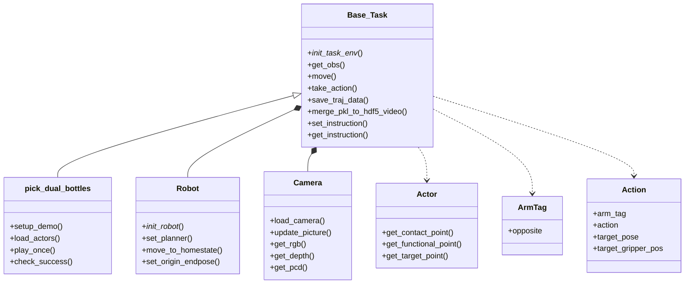
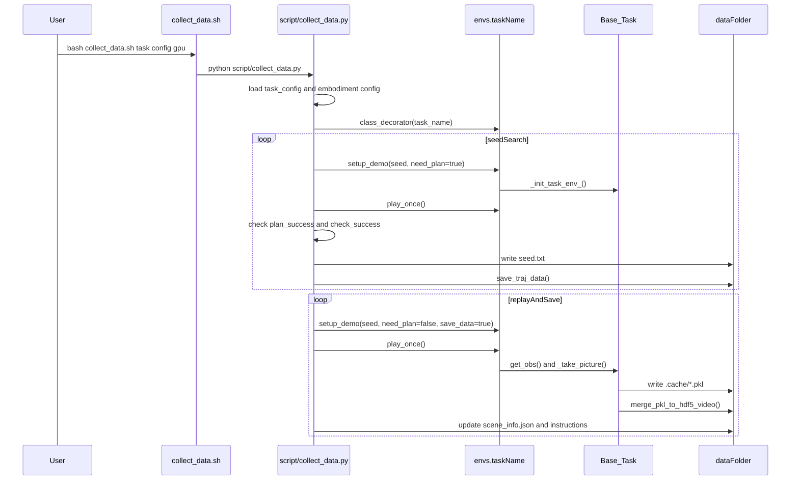
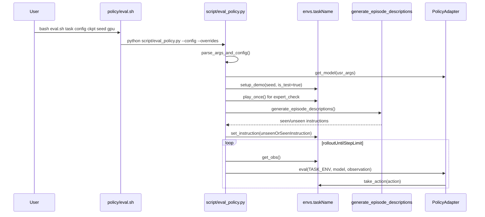
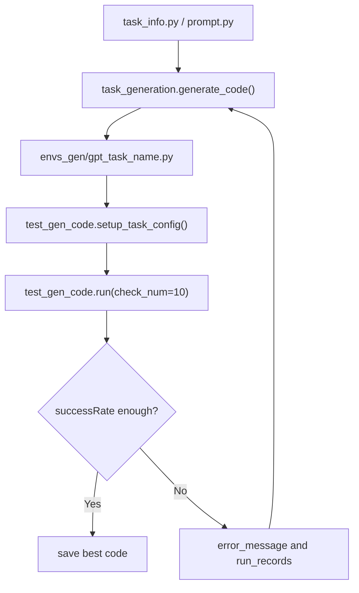
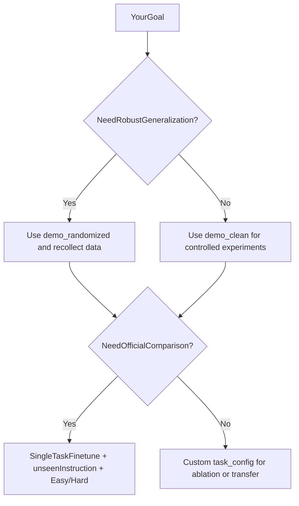

# RoboTwin 项目代码设计文档 2.0

本文基于 4 类材料整理：

1. 当前仓库实现本身。
2. RoboTwin 2.0 论文：[RoboTwin 2.0: A Scalable Data Generator and Benchmark with Strong Domain Randomization for Robust Bimanual Robotic Manipulation](https://arxiv.org/abs/2506.18088)。
3. 官方文档、README 与 Leaderboard。
4. 公开 issue、PR、commit 所反映的真实使用摩擦。

这份文档不打算重复一遍 `design1.md` 的全覆盖说明，而是回答 4 个更关键的问题：

- RoboTwin 的优势和作用到底是什么？
- 它的代码是怎么设计的？
- 为什么要这样设计？
- 怎样使用，才能真正发挥它的最大优势？

---

## 1. 先说结论：RoboTwin 的真正价值是什么

### 1.1 它不是“一个数据集”，而是一套双臂操作数据工厂

如果只看论文标题，RoboTwin 很容易被理解成一个双臂 benchmark；如果只看 `data/` 和 `policy/`，它又容易被理解成一个“已经有任务、已经有 baseline、照着跑就行”的项目。

但从代码结构看，RoboTwin 的核心定位更准确地说是：

> 一个以仿真环境 API 为核心、同时覆盖任务表达、专家数据生成、域随机化、策略评测、跨 embodiment 适配和代码生成的双臂操作研究平台。

这也是为什么它最强的地方，不是单独某一个目录，而是这些目录组合起来形成的闭环：

- `envs/` 负责把双臂任务抽象成统一运行时。
- `script/collect_data.py` 负责把“能成功执行的专家脚本”变成训练数据。
- `script/eval_policy.py` 负责把“策略推理”映射回统一的环境交互接口。
- `task_config/*.yml` 负责把随机化、相机、形态、落盘方式从代码里抽出来。
- `policy/*/deploy_policy.py` 负责把不同模型家族接入同一条评测链。
- `code_gen/` 负责把“自然语言任务描述 -> 可执行任务代码 -> 仿真验证”串起来。

### 1.2 论文、文档和代码共同说明了它的 5 个核心优势

| 维度 | 论文/文档信号 | 代码中的对应位置 | 我的判断 |
| --- | --- | --- | --- |
| 资产规模 | 731 个对象、147 个类别 | `assets/`、对象描述与语义点、`Actor` API | 不是玩具级资产库，而是能支撑泛化研究的对象底座 |
| 任务规模 | 50 个双臂任务、5 种 embodiment、10 万+ 轨迹 | `envs/*.py`、`task_config/`、`collect_data.py` | 不是单任务 demo，而是任务族和形态族 |
| 数据质量控制 | 论文强调 simulation-in-the-loop refinement，代码生成成功率提升 10.9% | `code_gen/task_generation.py` + `code_gen/test_gen_code.py` | 任务代码不是“一次生成”，而是验证后再修正 |
| 稳健性来源 | 五维域随机化、few-shot 367%、zero-shot 228% 提升 | `_base_task.py` 中随机背景、杂物、光照、桌高、语言分裂 | 平台价值不在“干净仿真”，而在“带分布差异的仿真” |
| 研究可扩展性 | 官方文档支持多策略接入、排行榜持续扩充 | `policy/*/deploy_policy.py`、`eval_policy.py` | 平台没有把自己锁死在某一种策略范式上 |

### 1.3 一张总览图：RoboTwin 的闭环能力



这张图里最重要的不是“模块很多”，而是它们之间的接口非常清晰：

- 环境统一由 `envs/` 提供。
- 数据统一由 `collect_data.py` 生产。
- 策略统一由 `deploy_policy.py` 接入。
- 配置统一由 YAML 控制。
- 泛化能力统一由 `demo_clean` / `demo_randomized` 和 `seen` / `unseen` 体系来衡量。

也就是说，RoboTwin 最大的作用不是替你写好某个任务，而是给你一套稳定的研究底盘。

---

## 2. 仓库地图：这套代码是怎样分层的

### 2.1 目录职责

| 路径 | 职责 | 不该把它误解成什么 |
| --- | --- | --- |
| `envs/` | 任务运行时核心，包含 `Base_Task`、`Robot`、`Camera`、每个任务脚本与工具 API | 不是简单的“任务脚本目录” |
| `script/` | 采集、评测、渲染、分布式推理等入口 | 不是业务逻辑的唯一来源 |
| `policy/` | 不同策略的适配层和训练代码 | 不是统一框架内部实现，而是插件区 |
| `task_config/` | 形态、相机、随机化、落盘等控制面 | 不是可有可无的辅助配置 |
| `description/` | 任务/物体语言描述与 episode 指令生成 | 不是独立于 benchmark 的装饰功能 |
| `code_gen/` | 自动任务代码生成与仿真验证闭环 | 不是单独的 side project |

### 2.2 系统组件图



### 2.3 推荐阅读顺序

如果你第一次读这个仓库，我建议的顺序是：

1. `README.md`
2. `script/collect_data.py`
3. `envs/_base_task.py`
4. 任意一个简单任务，例如 `envs/pick_dual_bottles.py`
5. `script/eval_policy.py`
6. 任意一个策略适配层，例如 `policy/DP/deploy_policy.py`
7. 再回来看 `task_config/`、`description/` 和 `code_gen/`

这个顺序的好处是：先理解“主流程”，再理解“扩展点”。

---

## 3. 核心抽象：为什么它不是 50 个任务脚本的堆叠

### 3.1 `Base_Task` 是整个项目的运行时内核

`envs/_base_task.py` 的核心价值，不是提供几个方便函数，而是把双臂操作环境的共同成本统一吸收掉：场景初始化、随机化、相机装配、机器人装配、稳定性检查、观测组织、动作执行、数据落盘、评测状态等，都在这里集中完成。

下面这段初始化骨架最能说明问题：

```python
def _init_task_env_(self, table_xy_bias=[0, 0], table_height_bias=0, **kwags):
    self.setup_scene()
    self.load_robot(**kwags)
    self.load_camera(**kwags)
    self.robot.move_to_homestate()
    self.together_open_gripper(save_freq=None)
    self.robot.set_origin_endpose()
    self.load_actors()
    if self.cluttered_table:
        self.get_cluttered_table()
    is_stable, unstable_list = self.check_stable()
```

这段设计的意义是：

- 任务作者不用重复写场景、相机、双臂初始化。
- 域随机化天然进入所有任务，而不是靠每个任务自己记得加。
- 任务代码能把精力放在“行为脚本”和“成功判据”上。

更重要的是，`Base_Task` 里有两类非常关键的统一接口：

1. 观测接口：`get_obs()`
2. 控制接口：`move()` / `take_action()`

`get_obs()` 输出的字典把视觉、点云、末端位姿、关节状态组织成统一 schema；这让不同策略可以在统一环境上只改“观测编码”，而不用改环境本体。

例如它在结构上先把数据划分成 4 个稳定区块：

```python
pkl_dic = {
    "observation": {},
    "pointcloud": [],
    "joint_action": {},
    "endpose": {},
}
```

### 3.2 这里用的是“约定式模板方法”，不是强制抽象基类

这一点值得特别说明，因为很多设计文档容易把它说得过度“面向对象”。

当前实现里：

- `Base_Task.play_once()` 和 `Base_Task.check_success()` 在基类里是 `pass`。
- `load_actors()` 不是 `abc` 抽象方法，但会在 `_init_task_env_()` 中被调用。
- 任务类通常自己实现 `setup_demo()`，并在里面调用 `super()._init_task_env_(**kwags)`。

也就是说，RoboTwin 采用的是一种很工程化的做法：

> 用强约定换轻量扩展，而不是用沉重的继承框架去约束所有任务。

这个选择很适合研究代码：

- 新任务接入快。
- 任务文件更短。
- 读一个具体任务时，心智负担低。

代价则是：

- 任务类需要遵守命名和接口约定。
- 框架错误更多会在运行期而不是类型层暴露。

### 3.3 `Robot` 把“形态差异”封装成装配问题

`envs/robot/robot.py` 的设计重点，不是单纯做运动学，而是把跨 embodiment 的差异尽量吸收到配置和装配逻辑里。

在 `script/collect_data.py` 和 `script/eval_policy.py` 里，形态解析的入口都非常明确：

```python
if len(embodiment_type) == 1:
    args["left_robot_file"] = get_embodiment_file(embodiment_type[0])
    args["right_robot_file"] = get_embodiment_file(embodiment_type[0])
    args["dual_arm_embodied"] = True
elif len(embodiment_type) == 3:
    args["left_robot_file"] = get_embodiment_file(embodiment_type[0])
    args["right_robot_file"] = get_embodiment_file(embodiment_type[1])
    args["embodiment_dis"] = embodiment_type[2]
    args["dual_arm_embodied"] = False
```

这意味着：

- `[aloha-agilex]` 代表一个成体的双臂系统。
- `[left, right, interval]` 代表左右臂异构拼装。

随后 `Robot._init_robot_()` 再去读取每个 embodiment 的 `config.yml`，拿到：

- URDF / SRDF 路径
- 夹爪与关节定义
- 末端执行器名称
- planner 类型
- 坐标系修正矩阵
- 同构或异构双臂装配方式

这套设计直接对应论文里“5 种 embodiment”和“cross-embodiment benchmark”的目标。平台没有把 embodiment 写死在代码里，而是尽量把它们变成配置驱动的组装问题。

### 3.4 `Camera` 把感知视角从任务逻辑中拆开

`envs/camera/camera.py` 的关键思路是：

> 任务定义物体与行为，相机系统定义观测方式，二者不要耦死。

它同时接收两类信息：

- 任务配置里的 `head_camera_type` / `wrist_camera_type`
- embodiment 配置里的 `static_camera_list`

于是项目可以同时拥有：

- 头部相机
- 左右腕部相机
- observer 相机
- world 点云视角

而且它天然支持 `random_head_camera_dis` 这类随机化。

这也是为什么视觉相关的变化，大多可以通过配置和 `Camera` 层解决，而不需要修改每个任务脚本。

### 3.5 `Actor`、`ArmTag`、`Action` 让任务脚本保持语义化

`envs/utils/actor_utils.py` 里的 `Actor` 不只是个刚体句柄，它把对象的语义点位也封装起来了：

```python
class Actor:
    POINTS = {
        "contact": "contact_points_pose",
        "target": "target_pose",
        "functional": "functional_matrix",
        "orientation": "orientation_point",
    }
```

这直接对应了论文里“对象有 manipulation-relevant annotations”的思想。对象不只是 mesh，而是带“可抓取点、功能点、目标点”的操作语义体。

与此同时，`envs/utils/action.py` 里的 `ArmTag` 和 `Action` 让双臂脚本能写得非常干净：

```python
class Action:
    def __init__(self, arm_tag, action, target_pose=None, target_gripper_pos=None, **args):
        ...
```

再看一个真实任务 `envs/pick_dual_bottles.py`，你就能看到这种 DSL 化的效果：

```python
self.move(
    self.grasp_actor(self.bottle1, arm_tag=bottle1_arm_tag, pre_grasp_dis=0.08),
    self.grasp_actor(self.bottle2, arm_tag=bottle2_arm_tag, pre_grasp_dis=0.08),
)

self.move(
    self.move_by_displacement(arm_tag=bottle1_arm_tag, z=0.1),
    self.move_by_displacement(arm_tag=bottle2_arm_tag, z=0.1),
)

self.move(
    self.place_actor(self.bottle1, target_pose=self.left_target_pose, arm_tag=bottle1_arm_tag, functional_point_id=0),
    self.place_actor(self.bottle2, target_pose=self.right_target_pose, arm_tag=bottle2_arm_tag, functional_point_id=0),
)
```

这就是 RoboTwin 任务层最漂亮的地方：

- 任务写作者在表达“语义动作”。
- 平台在底层完成规划、同步、渲染、落盘和检查。

### 3.6 核心类图



---

## 4. 三条关键工作流：RoboTwin 是怎样跑起来的

### 4.1 工作流一：数据采集不是“一次跑完”，而是“筛种子 + 回放落盘”

`script/collect_data.py` 的设计非常值得单独讲，因为它决定了 RoboTwin 的数据质量观。

任务加载入口非常简洁：

```python
def class_decorator(task_name):
    envs_module = importlib.import_module(f"envs.{task_name}")
    env_class = getattr(envs_module, task_name)
    env_instance = env_class()
    return env_instance
```

这段代码背后的约定是：

- 文件名 = 模块名 = 类名
- 新增任务的成本主要是“新增一个符合命名约定的任务文件”

更关键的是采集本身分成两阶段：

1. 搜索可成功执行的 seed，并保存预规划轨迹。
2. 用这些成功 seed 回放并真正落盘成 HDF5 / video。

对应序列图如下：



为什么这样设计？

- 第一阶段先筛掉不稳定 seed 和失败动作序列。
- 第二阶段再专心做高质量数据落盘。
- `seed.txt` 和 `_traj_data/*.pkl` 让数据采集具备恢复和重放能力。

这比“第一次执行就直接边跑边存”更稳，也更接近论文里“专家级数据生成”的要求。

### 4.2 工作流二：策略评测的核心不是模型，而是统一 ABI

RoboTwin 的策略设计思路非常清晰：

> 平台不规定你用什么模型，但规定你怎样接进来。

`script/eval_policy.py` 的主线是：

1. 读取任务配置。
2. 通过 `policy_name` 动态加载策略包。
3. 调用统一的 `get_model()` / `eval()` / `reset_model()`。
4. 在统一环境循环里执行 `get_obs() -> eval() -> take_action()`。

策略接入侧的模板非常薄：

```python
def get_model(usr_args):
    ...

def eval(TASK_ENV, model, observation):
    ...

def reset_model(model):
    ...
```

例如 `policy/DP/deploy_policy.py` 就是这种最标准的实现方式。

评测序列图如下：



这个流程里最值得注意的不是 rollout 本身，而是两个细节：

1. **expert check 在前**  
   评测前会先检查该 seed 上专家脚本是否成功，避免把“环境本身就不可行”的 case 误算进策略失败。

2. **语言指令在评测时动态注入**  
   `generate_episode_descriptions()` 会基于 `scene_info.json` 和 `task_instruction/*.json` 生成 episode-specific instruction，再根据 `instruction_type` 取 `seen` 或 `unseen`。

这也解释了为什么 `policy/*/deploy_policy.yml` 里几乎都把 `instruction_type` 设成了 `unseen`：这不是附属功能，而是 benchmark 设计的一部分。

### 4.3 工作流三：代码生成不是“写文件”，而是“生成 -> 测试 -> 修正”

论文里把 RoboTwin 2.0 的一个核心贡献描述为 MLLM + simulation-in-the-loop 的专家代码生成；当前仓库里的 `code_gen/`，正是这个思想的开源骨架实现。

它的主流程是：



这里有两个很重要的设计信号：

- 开源代码不是“直接调用大模型就结束”，而是有测试回路。
- `test_gen_code.run()` 默认按多次仿真统计成功率和错误类别，这和论文里“执行 10 次并记录失败原因”的思路是对齐的。

当前开源代码与论文完整版之间也有一个需要实事求是的区别：

- 论文叙述中有更强的 VLM observer 与更完整的多模态反馈闭环。
- 当前仓库公开实现里，最核心、最可直接看到的是“代码生成 + 仿真验证 + 基于错误反馈迭代修正”的骨架。

也就是说，RoboTwin 的 `code_gen/` 已经说明平台不是固定任务集，而是在努力把“任务扩展能力”也纳入平台设计。

---

## 5. 为什么要这样设计：我认为最关键的 7 个设计决策

### 5.1 设计决策总表

| 设计决策 | 代码表现 | 这样做的原因 | 代价 |
| --- | --- | --- | --- |
| 动态导入任务与策略 | `importlib.import_module()` in `collect_data.py` / `eval_policy.py` | 新任务、新 baseline 接入成本低 | 依赖命名约定，静态发现能力弱 |
| YAML 控制面 | `task_config/*.yml`、`_embodiment_config.yml`、`_camera_config.yml` | 实验配置可复现、可切换、可批量化 | 配置项多了以后需要维护文档一致性 |
| `Base_Task` 中央化 | 初始化、观测、控制、落盘都在 `_base_task.py` | 任务代码短，平台能力一致 | 基类变大，理解门槛集中 |
| 语义对象点 API | `Actor.get_contact_point()`、`get_functional_point()` | 让任务写在语义层，而不是刚体层 | 资产标注质量直接影响任务质量 |
| 双层执行模型 | `play_once()` 与 `take_action()` 并存 | 同时服务专家采集与策略 rollout | 新读者初看时容易混淆两套接口 |
| `seen` / `unseen` 显式分裂 | 背景纹理、物体描述、`instruction_type` | benchmark 直接面向泛化 | 复现时必须非常注意配置一致性 |
| 策略薄适配层 | `deploy_policy.py` 统一 ABI | 不把平台锁死在某个模型家族 | 策略作者需要自行处理观测编码 |

### 5.2 为什么动态导入是对的

RoboTwin 的任务和策略都采用了插件式加载。这个设计很朴素，但非常适合研究平台：

- 增加一个任务，本质上就是增加一个新的 `envs/<task>.py`。
- 增加一个策略，本质上就是增加一个新的 `policy/<name>/deploy_policy.py`。

这比写一大堆注册表更轻，也符合“任务名/策略名就是实验配置输入”的使用方式。

如果把它换成强注册系统，平台会更“工程化”，但扩展速度会更慢；而 RoboTwin 显然更重视研究迭代速度。

### 5.3 为什么 YAML 控制面是平台的核心，而不是配角

RoboTwin 的随机化、相机、形态、落盘、缓存清理、评测视频等行为，绝大多数都不是硬编码在任务脚本里，而是从配置灌进运行时。

例如 `task_config/demo_randomized.yml` 明确控制：

- `domain_randomization`
- `camera`
- `data_type`
- `save_freq`
- `clear_cache_freq`
- `collect_data`

这带来 3 个直接好处：

1. 实验切换不需要改代码。
2. 训练/评测/消融都能通过配置复现。
3. 任务逻辑与实验协议分离。

RoboTwin 能从“任务仓库”升级成“benchmark 平台”，很大程度上就靠这层控制面。

### 5.4 为什么要把 `play_once()` 和 `take_action()` 分开

这是我认为整个项目里最重要、也最容易被低估的设计。

两者职责完全不同：

| 接口 | 服务对象 | 输入语义 | 典型用途 |
| --- | --- | --- | --- |
| `play_once()` | 专家脚本 / 任务作者 | 语义动作 API | 生成专家轨迹、做 expert check |
| `take_action()` | 学习策略 / 部署模型 | 连续动作向量 | rollout、闭环评测 |

`play_once()` 允许任务作者用 `grasp_actor()`、`place_actor()`、`move_by_displacement()` 写高层逻辑；  
`take_action()` 则允许学习策略用 `qpos` 或 `ee` 直接驱动环境。

这套拆分的结果是：

- 平台既能做脚本专家数据生成。
- 又能做统一策略评测。
- 还能让这两条链路共享同一套环境和观测定义。

如果没有这层拆分，RoboTwin 就很容易退化成“要么只适合专家脚本，要么只适合策略 rollout”的单用途系统。

### 5.5 为什么 `seen` / `unseen` 不只是论文概念，而是代码里的真实机制

RoboTwin 的一个优点是：泛化分裂不是写在论文里、忘在代码里，而是真的进入了运行时。

例如背景纹理在 `eval_mode` 下会切到 `unseen`：

```python
if self.random_background:
    texture_type = "seen" if not self.eval_mode else "unseen"
```

语言描述也有显式的 `seen` / `unseen` 两套替换逻辑，`generate_episode_descriptions()` 会按 episode 参数生成对应指令。

这件事很重要，因为它说明 RoboTwin 的 benchmark 不是“训练集和测试集只是换个随机种子”，而是显式把视觉和语言分布切开。

### 5.6 为什么要支持 server/client 分离

`script/policy_model_server.py` 和 `script/eval_policy_client.py` 的存在，说明作者很清楚一个现实问题：

> 在双臂仿真、视频记录、点云处理和大模型推理共存时，GPU 和进程内存很容易互相打架。

所以平台没有强迫所有策略都走进程内推理，而是额外提供了模型服务端 / 评测客户端分离模式。

这不是锦上添花，而是平台成熟度的表现：

- 小模型可以直接本地跑。
- 大模型可以拆进程甚至拆环境跑。

### 5.7 为什么 `Base_Task` 要同时管观测和落盘

很多系统会把“环境交互”和“数据落盘”拆成两个层。RoboTwin 没这么做，而是让 `Base_Task` 直接管理：

- `_take_picture()`
- `save_traj_data()`
- `merge_pkl_to_hdf5_video()`

这看起来让基类更大，但它有一个明显好处：

> 数据格式与环境语义天然一致。

也就是说，平台不会出现“环境这么定义、数据那样保存、策略再自己猜一遍”的三套接口错位问题。

对于 benchmark 和数据生成平台，这比“教科书式分层”更重要。

---

## 6. 怎么用，才能把 RoboTwin 的优势真正发挥出来

### 6.1 第一原则：把 RoboTwin 当成“可配置生成器”，不要只当成静态数据集

README 已经明确建议用户自己采集数据，而不是只依赖预采集轨迹。我很赞同这个建议。

原因很简单：

- RoboTwin 的核心优势是高可配置。
- 一旦你只用别人已经采好的数据，就损失了 embodiment、相机、随机化、语言分布这些可控变量。

如果你的目标是泛化或 sim-to-real，最值得做的不是“找现成数据最多的一份”，而是：

1. 选定目标任务。
2. 选定目标 embodiment。
3. 选定你的相机与随机化设置。
4. 重新采一份和你实验问题真正对齐的数据。

### 6.2 第二原则：官方对比时，按 benchmark 协议来，不要自己脑补协议

从官方 leaderboard 和 issue #267 可以看出，RoboTwin 的官方 benchmark 语境非常明确：

- 按单任务微调来做对比。
- 评测使用 `instruction_type: unseen`。
- 区分 `demo_clean` 和 `demo_randomized` 对应的 Easy / Hard 语境。

这意味着如果你想复现实验或和官方结果对齐，最好不要：

- 把多任务训练结果直接拿来和单任务微调比。
- 用 seen instruction 代替 unseen instruction。
- 只在干净配置上评测，却拿去对比 Hard 结果。

### 6.3 第三原则：想做稳健策略，就优先用 `demo_randomized`

这几乎是 RoboTwin 2.0 和许多“干净仿真 benchmark”最大的区别。

`demo_randomized` 不是附加选项，而是平台价值的核心之一。因为它同时把以下因素显式带进训练分布：

- 杂物
- 背景纹理
- 光照
- 桌高
- 语言描述

如果你的目标是：

- 视觉稳健性
- 语言条件泛化
- sim-to-real 迁移
- 对场景变化不那么脆弱的策略

那么优先策略应该是：



### 6.4 第四原则：新增任务时，要复用任务 DSL，而不是绕开它

如果你想加一个新任务，最好的方式不是在任务文件里直接写一堆底层关节控制，而是：

1. 让 `setup_demo()` 只负责调用 `_init_task_env_()`。
2. 在 `load_actors()` 里放对象创建与目标位姿。
3. 在 `play_once()` 里尽量使用 `grasp_actor()`、`place_actor()`、`move_by_displacement()`、`move()`。
4. 在 `check_success()` 里定义清晰、稳定、可重复的成功条件。

原因很现实：

- `check_success()` 既影响 seed 过滤，也影响 benchmark 计分。
- 你越复用现有 DSL，越容易继承平台已有的 planner、同步、数据落盘和随机化能力。
- 你越绕开这些抽象，越容易把新任务变成“只能自己跑通、无法和平台其它部分兼容”的孤岛。

### 6.5 第五原则：新增策略时，做“薄适配”，不要让模型细节侵入平台

`policy/Your_Policy/deploy_policy.py` 的模板思想是对的：让适配层尽量薄。

推荐做法是：

- `encode_obs()` 只做观测整理。
- `get_model()` 只做模型初始化与 checkpoint 加载。
- `eval()` 负责把模型动作投喂给 `TASK_ENV.take_action()`。
- `reset_model()` 只做 episode 级状态清理。

不要轻易做的事是：

- 直接改 `eval_policy.py` 来迎合某个模型。
- 让策略自己定义另一套环境循环。
- 在策略层重新发明一套 instruction / observation 协议。

RoboTwin 的强项是“很多策略可以共享一套评测主线”，不是“每个策略都魔改一遍平台”。

一个实用细节是，`script/eval_policy.py` 会先读取 `deploy_policy.yml`，再通过 `--overrides` 覆盖关键参数。  
这让“固定评测协议”和“灵活实验参数”可以同时成立，也减少了反复手改 YAML 带来的误差。

### 6.6 第六原则：大模型评测时，优先考虑 server/client 模式

当策略模型很大、显存很紧张，或者你希望把推理与仿真分开时，可以考虑：

- `script/policy_model_server.py`
- `script/eval_policy_client.py`

这套模式特别适合：

- VLA / 多模态大模型
- 推理慢于环境步频的策略
- 希望更清晰地隔离环境依赖和模型依赖的场景

它的价值不是“更高级”，而是“更稳”。

### 6.7 第七原则：把运行稳定性当成平台使用的一部分

RoboTwin 并不是“只要 `pip install` 就完了”的纯 Python 项目。官方安装文档和 `script/_install.sh` 非常诚实地告诉你，这个平台的工程前提包括：

- SAPIEN / Vulkan / ffmpeg 等运行依赖
- `script/_install.sh` 中对 SAPIEN 与 MPLib 的补丁
- Hugging Face 资产下载
- 服务器环境下 `render_freq: 0`
- `clear_cache_freq` 和 `save_freq` 的权衡
- 官方安装文档还提醒过某些 A/H 系列 GPU 上可能出现采集卡住问题

因此我的建议是：

- 把安装脚本和资产下载当成平台契约的一部分。
- 把 `clear_cache_freq` 看成稳定性参数，而不是小优化项。
- 把 `seed.txt` 看成“在同一代码/配置/资产条件下的重放索引”，而不是绝对复现凭证。

---

## 7. 现实边界与社区反馈：这套设计很强，但不是零摩擦

RoboTwin 的优势很明显，但它不是“屏蔽一切底层复杂度”的黑盒。公开 issue、PR 和 commit 历史恰好能帮助我们更真实地理解它的边界。

### 7.1 公开信号说明了哪些真实问题

| 公开信号 | 暴露的问题 | 我对设计层的解读 |
| --- | --- | --- |
| issue #288：仅凭 seed 无法完全复现数据集环境 | 用户以为 seed 就等于完整复现 | RoboTwin 的复现粒度依赖代码版本、配置、资产、scene info，不是单一随机数 |
| issue #267：VLA 复现细节提问 | 用户不确定官方协议是单任务还是多任务、seen 还是 unseen | benchmark 协议本身就是平台的一部分，不能只看代码能不能跑 |
| issue #297：碰撞异常 | 某些任务下物理交互可能出现极端行为 | 说明平台仍然建立在真实物理仿真和启发式资产/碰撞设置之上，不是形式化验证系统 |
| PR #294：腕部相机近裁剪面修复 | wrist view 对近裁剪面非常敏感 | 感知细节会直接影响训练与评测可信度，Camera 层不是小配件 |
| PR #255：路径配置修复 | code_gen 等模块对项目根目录假设很强 | 说明这个平台依赖“从仓库根目录运行”的使用契约 |
| 安装文档对底层依赖和 GPU 卡住问题的提醒 | 运行问题不全是 Python 层 bug | RoboTwin 的“平台”属性决定了它天然依赖仿真、渲染和系统环境的一致性 |
| commit 历史中多次更新 endpose、seed recovery、robust get_pcd、更多 policy/embodiment | 平台在持续补齐接口稳定性和扩展性 | 架构主干稳定，但边界层仍在快速演化 |

### 7.2 这些边界恰好反向证明了 RoboTwin 的特点

这些问题并不意味着设计不好，反而说明了 RoboTwin 的本质：

1. 它是一个“真实可扩展的仿真平台”，所以会暴露资产、相机、碰撞、缓存、路径等现实问题。
2. 它追求的是高扩展性与研究速度，而不是把所有复杂性都抽成不可见的黑盒。
3. 它的很多优势来自“平台可配置”，而可配置的另一面就是“需要用户理解配置语义”。

所以正确的使用姿势不是抱怨“为什么还要管这些细节”，而是承认：

> RoboTwin 的价值就在于它把这些原本散落在多套脚本里的复杂度，尽量收束到了统一的平台接口和工作流里。

### 7.3 当前版本里我认为最需要注意的几个细节

#### 1. `qpos` / `ee` 是当前最稳定的动作主线

`policy/Your_Policy/deploy_policy.py` 的注释里提到了 `delta_ee`，但当前 `Base_Task.take_action()` 的主接口签名是：

```python
def take_action(self, action, action_type:Literal['qpos', 'ee']='qpos'):
```

所以从“当前仓库稳定实现”的角度，我会把 `qpos` 与 `ee` 视为主路径，把 `delta_ee` 视为模板层留下的扩展方向，而不是默认稳定 ABI。

#### 2. 复现不只是 seed

如果你要重放某个 episode，至少要同时对齐：

- 代码版本
- 任务配置
- assets 版本
- scene_info / instruction 生成逻辑
- 评测模式（是否 `eval_mode`）

否则你会得到“seed 一样但场景不完全一样”的体验。

#### 3. `check_success()` 的质量直接决定平台可信度

因为它同时用于：

- seed 筛选
- 数据采集验证
- benchmark 成功统计

所以一个任务里最不该随便写的函数，往往不是 `play_once()`，而是 `check_success()`。

---

## 8. 我对 RoboTwin 代码设计的最终判断

### 8.1 它最成功的地方

我认为 RoboTwin 最成功的不是某个单点实现，而是下面这 4 件事同时成立：

1. 它把任务、感知、机器人形态、数据采集、策略评测放进了同一套运行时。
2. 它没有把平台锁死在某一种策略家族上。
3. 它把泛化问题写进了代码和配置，而不是只写进论文指标。
4. 它给“新增任务”和“新增策略”都留了清晰的扩展缝。

### 8.2 它为什么值得做代码设计文档

因为 RoboTwin 不是那种“读一遍 README 就能完全理解”的仓库。

它真正的价值藏在这些设计关系里：

- `Base_Task` 为什么要这么大。
- `play_once()` 和 `take_action()` 为什么要分开。
- `Actor` 为什么要有功能点和目标点。
- `task_config/` 为什么比很多人想象得更重要。
- `deploy_policy.py` 为什么故意做得很薄。
- `demo_randomized` 为什么才是 RoboTwin 2.0 的灵魂。

### 8.3 怎样才能最大化利用这个平台

如果只用一句话总结，我会这么说：

> 把 RoboTwin 当成“可配置的数据生成与评测底盘”，而不是“一个带 baseline 的静态任务仓库”。

更具体地说：

- 想做稳健泛化，就优先用 `demo_randomized` 自采数据。
- 想做官方对比，就严格遵守单任务微调和 `unseen` 指令评测协议。
- 想加新任务，就复用 `Base_Task` 的语义动作 API，不要回到手搓底层控制。
- 想接新策略，就把改动收敛在 `deploy_policy.py`，不要污染平台主流程。
- 想要稳定运行，就把资产、安装补丁、缓存清理和路径契约视作平台设计的一部分。

---

## 9. 附：我建议长期保留的阅读与扩展路径

### 9.1 任务作者

建议优先读：

1. `envs/_base_task.py`
2. `envs/pick_dual_bottles.py`
3. 你要模仿的相近任务

### 9.2 策略作者

建议优先读：

1. `script/eval_policy.py`
2. `policy/Your_Policy/deploy_policy.py`
3. 一个真实策略适配层，如 `policy/DP/deploy_policy.py`

### 9.3 平台维护者

建议优先读：

1. `script/collect_data.py`
2. `envs/_base_task.py`
3. `envs/robot/robot.py`
4. `envs/camera/camera.py`
5. `task_config/*.yml`
6. `script/_install.sh`

---

## 10. 结语

RoboTwin 的强，不在于它把双臂操作问题“简化掉”了；恰恰相反，它承认双臂操作研究里真正重要的复杂性来自：

- 任务多样性
- 视觉与语言分布变化
- 机器人形态差异
- 专家数据质量控制
- 策略接入异构性

而这套项目最有价值的地方，是它没有回避这些复杂性，而是用一套统一的代码结构把它们组织了起来。

因此，从代码设计角度看，我对 RoboTwin 的评价是：

> 它最像一个面向研究的双臂操作“操作系统内核”，而不是一个单纯的 benchmark 或数据仓库。

这也是为什么它值得被认真阅读、认真配置、认真扩展。
